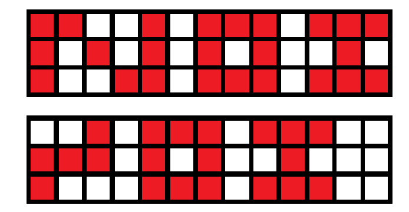
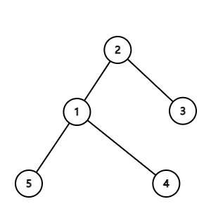
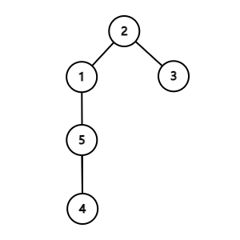

<div align='center' ><font size='70'>模拟赛</font></div>

| 中文题目名称 | 随机数     |    街道    |   NOI    | 树       |
| :----------: | ---------- | :--------: | :------: | -------- |
| 英文题目名称 | random     |   street   |   noi    | tree     |
|  题目文件名  | random.cpp | street.cpp | noi.cpp  | tree.cpp |
|  输入文件名  | random.in  | street.in  |  noi.in  | tree.in  |
|  输出文件名  | random.out | street.out | noi.out  | tree.out |
|   时间限制   | 1s         |     1s     |    1s    | 1s       |
|   空间限制   | 512M       |    512M    |   512M   | 512M     |
| 结果比较方式 | 全文比较   |  实数比较  | 全文比较 | 实数比较 |

编译选项：

| C++  | -std=c++14 -O2 -Wl,--stack=204800000 |
| :--: | :----------------------------------: |

评测环境为 Windows 64 位，处理器：`Intel(R) Core(TM) i7-9750 CPU @ 2.60GHz`。

内存 16GB，速度 2667MHz，编译器为 `g++ 9.1.0`。

<div STYLE="page-break-after: always;"></div>

# 随机数（random/1s/512M）

### 题目描述

星野瞳想要生成随机数，她觉得现在的随机数生成方式不够优秀，所以设计了一种新的随机数生成方式。

假设需要生成一个 $[0,m-1]$ 的随机整数，她会先用现有的随机数生成器生成 $n$ 个 $[0,m-1]$ 的整数，构成一个整数序列 $a$，$a$ 的下标从 $1$ 开始。

然后，她对这个整数序列做 $n-1$ 次操作，每次操作她都会计算一个新的整数序列 $b$，$b$ 的长度为 $n-1$ ，满足 $b_i=a_i+a_{i+1}$。最后令 $a=b$。

容易发现，最后一定只会剩下一个整数，星野瞳将这个整数对 $m$ 取余数之后，作为生成的随机数。

星野瞳把这个生成方式分享给了真姬，但真姬指出，对于某些 $n,m$ ，最后得到的随机数与 $a$ 中的某些数无关。

星野瞳现在想知道，对于一组给定的 $n,m$，最终的随机数与 $a$ 中的哪些位置无关。

### 输入格式

第一行包含两个正整数 $n,m$。

### 输出格式

第一行一个正整数 $cnt$，表示 $a$ 中与最终随机数无关的数的个数。

第二行 $cnt$ 个正整数，从小到大依次输出，表示每个与最终随机数无关的数的下标。

#### 样例输入 #1

```plain
3 2
```

#### 样例输出 #1

```plain
1
2
```

### 数据范围与约定

本题采用 **捆绑测试**，无子任务依赖。

对于全部数据，$n\le 10^5,m\le 10^9$。

- 子任务 $1$ ($30$ 分)：$n\le 10^3$
- 子任务 $2$ ($30$ 分)：$m$ 为质数。
- 子任务 $3$ ($40$ 分)：无其它限制。

<div STYLE="page-break-after: always;"></div>

# 街道（street/1s/512M）

### 题目描述

渡边家兴的女朋友秋子和他闹了矛盾，去了新宿区的某个地方，渡边家兴想要尽快找到他的女朋友。

新宿区是星野组的地盘，可以描述为一棵 $n$ 个节点的树，入口为 $1$ 号节点，每条树边表示一条双向街道，通过每一条街道的时间都相等。在街道的交汇处，也就是节点，可能有星野组的小弟把守。

渡边家兴已经知道，秋子一定沿着一条**简单路径**跑到了树的一个叶子，但他不知道具体在哪个叶子，所以他只好挨个寻找。渡边家兴在节点处可以询问小弟，秋子是否经过了这个节点，询问小弟不需要花费时间。

作为星野组的地区负责人，渡边家兴随时面临着被暗杀的风险，所以寻找女朋友的过程中，渡边家兴最多只能经过一条街道两次。

渡边家兴想知道，如果秋子在每个叶子处的概率相等的情况下，他找到秋子的期望时间最小是多少。

### 输入格式

第一行一个正整数 $n$，表示节点个数。

接下来 $n-1$ 行，每行一个正整数和一个字母，由空格分开，第 $i$ 行的正整数表示第 $i$ 号点的父节点，字母为 `Y` 或者 `N`，表示该点是否有星野组的小弟把守。

### 输出格式

一行一个浮点数，表示渡边家兴找到女朋友的期望时间的最小值

**你的答案被认为正确，当且仅当和标准答案的绝对或相对误差不超过 $10^{-6}$**

#### 样例输入 #1

```plain
5
1 N
1 Y
3 N
3 N
```

#### 样例输出 #1

```plain
3.0000
```


#### 样例解释 #1

渡边家兴有两种方案，他可以先到 $2$ 号节点，再到 $3$ 号节点，然后依次去 $4,5$ 号节点，期望时间为 $\dfrac{1+4+6}{3}=3.6667$

他也可以先到 $3$ 号节点询问小弟，如果秋子经过了 $3$ 号节点，那么他可以依次去 $4,5$ 号节点，否则他直接去 $2 $ 号节点，期望时间为 $\dfrac{2+3+4}{3}=3$

#### 样例输入 #2

```plain
10
1 Y
1 N
2 N
2 N
2 N
3 N
3 Y
8 N
8 N
```

#### 样例输出 #2

```plain
5.0000
```

### 数据范围与约定

本题采用 **捆绑测试**，无子任务依赖。

对于全部数据，$n\le 10^5$。

- 子任务 $1$ ($20$ 分)：$n\le 10$。
- 子任务 $2$ ($20$ 分):   $i$ 号点的父亲在 $[\max(i-5,1),i-1]$ 中随机选择。
- 子任务 $2$ ($30$ 分)：任何节点都没有小弟把守。
- 子任务 $3$ ($30$ 分)：无其它限制。

<div STYLE="page-break-after: always;"></div>

# NOI（noi/1s/512M）

### 题目描述

星野瞳卸任首相后回到天朝后学习了信息竞赛，她成功进入了省队，即将去参加 NOI2024。

作为星野组的元老，也是共义党的高级干部大岛成悟打算为星野瞳写一副 `NOI` 的书法字。

大岛成悟找来了一张书法纸，可以描述为一个 $n\times m$ 的矩阵，每个格子都有一个幸运值 $a_{i,j}$。

`NOI` 三个字母分别由若干个矩形构成，定义如下：

- `N` 由若干（$\ge 3$）个边平行于坐标轴的矩形组成，设由 $K$ 个矩形组成（标号 $1 \ldots K$），第 $i$ 个矩形的左下角方格坐标设为 $(L_i, B_i)$，右上角坐标设为 $(R_i, T_i )$，要求满足：
  1. $L_i \le R_i, B_i \le T_i$；
  2. 对任意 $1 < i \le K$，有 $L_i = R_{i-1} + 1$；
  3. 对任意 $3 \le i < K$，有 $B_{i−1} − 1 \le T_i \le T_{i-1}$，$B_i \le B_{i-1}$；
  4. $B_2 > B_1$，$T_2 = T_1$，$B_{K-1} = B_K$，$T_{K-1} < T_K$；
- `O` 由一个大矩形 $A$，挖去一个小矩形 $B$ 得到，这两个矩形的边都平行于坐标轴。设大矩形 $A$ 左下角的方格坐标为 $(u, v)$，长为 $W$，宽为 $H$，则小矩形 $B$ 满足左下角方格坐标为 $(u + 1, v + 1)$，长 $W - 2$，宽 $H - 2$。要求满足：
  1. $W \ge 3$，$H \ge 3$；
  2. $u > R_K + 1$；
- `I` 为 $3$ 个边平行于坐标轴的从下到上的实心矩形组成，从下到上依次标号为 $1,2,3$，第 $i$ 个矩形的左下角格子坐标设为 $(P_i , Q_i )$，右上角格子坐标设为 $(G_i , H_i )$，要求满足：
  1. $P_i \le G_i , Q_i \le H_i$；
  2. $P_1 = P_3 > u + W$，$G_1 = G_3$；
  3. $Q_1 = H_1 = Q_2 − 1, H_2 + 1 = Q_3 = H_3$；
  4. $P_1 < P_2 \le G_2 < G_1$

下图是一个 `NOI` 的例子。


大岛成悟当然希望，所有矩阵覆盖的格子的幸运值最大。

他希望你告诉他幸运值的最大值。

### 输入格式

第一行两个正整数 $n,m$ ，表示矩阵大小

接下来 $n$ 行每行 $m$ 个正整数，表示 $a_{i,j}$

### 输出格式

输出一行一个正整数，表示最大的幸运值。

#### 样例输入1

```plain
3 13 
1 1 -1 -1 1 -1 1 1 1 -1 1 1 1 
1 -1 1 -1 1 -1 1 -1 1 -1 -1 1 -1 
1 -1 -1 1 1 -1 1 1 1 -1 1 1 1 
```

#### 样例输出1

```plain
24
```

#### 样例输入2

```plain
3 13
-1 -1 -1 -1 -1 -1 -1 -1 -1 -1 -1 -1 -1
-1 -1 -1 -1 -1 -1 -1 -1 -1 -1 -1 -1 -1
-1 -1 -1 -1 -1 -1 -1 -1 -1 -1 -1 -1 -1
```

#### 样例输出2

```plain
-20
```

#### 样例解释

从上到下分别是样例一，二的一种方案。



### 数据范围与约定

对于所有的测试数据，保证 $3\le n \le 150,12 \le m \le 500,|a_i|\leq 10^3$。

本题采用 **捆绑测试**，**子任务 $4$ 依赖所有子任务**。

- 子任务 $1$ ($20$ 分)：$n=3,m=12$。
- 子任务 $2$ ($30$ 分)：$n,m\le 80$
- 子任务 $3$ ($10$ 分)：$a_{i,j} =1$
- 子任务 $4$ ($40$ 分)：无其它限制。

# 树（tree/1s/512M）

### 题目描述

星野瞳在 NOI2024 的赛场上坐牢，她并不会 T2,T3，做完 T1，打完暴力后她就开始发呆。

她在下发的草稿纸上开始画树，并开始遍历画出来的树。

她惊讶的发现，对于某些树，其 DFS 序和 BFS 序都是相同的。

星野瞳很快提出了一个问题，如果给定两个序列，分别表示某棵树的 DFS 序和 BFS 序，那么，所有拥有这个 DFS 序和 BFS 序的树的平均高度是多少。

虽然星野瞳不会做 NOI2024 的后两题，但这么简单的问题她还是会的，她决定把这个题目拿去考考星野组的小弟，你能回答星野瞳的问题吗？

我们令所有拥有这个 DFS 序和 BFS 序的树的个数为 $K$，高度为 $H_i$。星野瞳希望你求出
$$
\Large\dfrac{H_1+H_2+\dots,+H_K}{K}
$$


为了避免一些问题，星野瞳保证给出的 DFS 序和 BFS 序一定有对应的树。她还规定，在每个节点处，**DFS 和 BFS 遍历边的顺序完全相同。**

### 输入格式

第一行包含 $1$ 个正整数 $n$，表示树的节点个数。

第二行包含 $n$ 个正整数，是一个 $1 \ldots n$ 的排列，表示树的 DFS 序。

第三行包含 $n$ 个正整数，是一个 $1 \ldots n$ 的排列，表示树的 BFS 序。

### 输出格式

输出 $1$ 个浮点数，表示树高的平均值。

**你的答案被认为正确，当且仅当和标准答案的绝对或相对误差不超过 $10^{-6}$**

#### 样例输入1

```plain
5 
2 1 5 4 3 
2 1 3 5 4
```

#### 样例输出1

```plain
3.500
```

### 样例解释1

合法的树一共有两棵。




### 数据范围与约定

对于所有的测试数据，保证 $n\le 2\times 10^5$。

本题采用 **捆绑测试**，**子任务 $5$ 依赖所有子任务**。

- 子任务 $1$ ($10$ 分)：$n\le 10$。
- 子任务 $2$ ($20$ 分)：$n,m\le 100$
- 子任务 $3$ ($20$ 分)：$n,m\le 2000$
- 子任务 $4$ ($10$ 分)：BFS 序和 DFS 序完全相同。

- 子任务 $5$ ($40$ 分)：无其它限制。